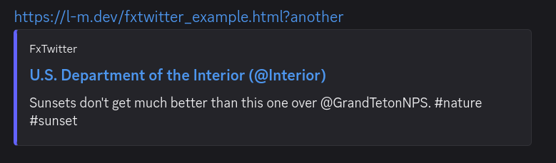
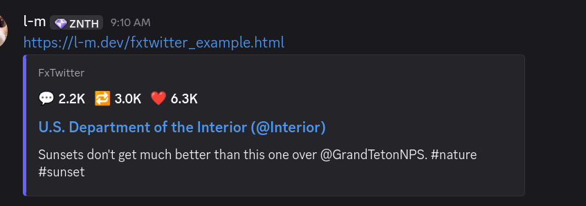
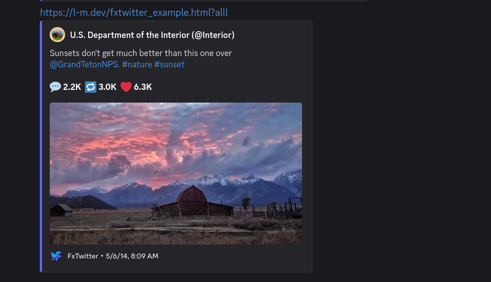
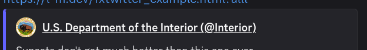
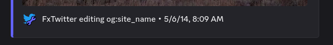

# awesome embeds

we want to trick discord into thinking that we're a mastodon instance so we get super rich embeds

---

1. keep a baseline, so og:title, og:description, og:image, twitter:card=summary_large_image, etc.
these are the fallbacks. what ISN'T a fallback is "theme-colour" which is actually used.

2. attach html link tags for
   
   application/json+oembed
   
   application/activity+json      (if you add this, DiscordBot will treat this as a mastodon instance)

# one fxtwitter post

```sh
curl -s -H "User-Agent: Discordbot/2.0" \
    https://fxtwitter.com/Interior/status/463440424141459456 > fxtwitter_example.html
```

important to note, basically the crux of this is that if you detect that the request is from a DiscordBot useragent, it sends the 2nd link tag

```html
<!-- opengraph tags above -->

<!-- application/json+oembed -->
<link rel="alternate"
    href="https://fxtwitter.com/owoembed?text=%F0%9F%92%AC%202.2K%20%20%20%F0%9F%94%81%203.0K%20%20%20%E2%9D%A4%EF%B8%8F%206.3K&status=463440424141459456&author=Interior"
    type="application/json+oembed" title="U.S. Department of the Interior">

<!-- application/activity+json -->
<!-- if(user agent is DiscordBot !!) -->
<link href='https://fxtwitter.com/users/Interior/statuses/660866676656585556565256545653565356576156575866'
    rel='alternate' type='application/activity+json'>
```

there are three different modes based on 

- opengraph
- opengraph + oembed
- opengraph - og:image + activitypub faking

important to know, either oembed **or** activitypub is used

## pure opengraph



## application/json+oembed (+ opengraph)

the most important part of the oembed is the "author_name" field as it allows you to stuff whatever you want in here at the top line



<details>
<summary>see the JSON for the oembed</summary>

see https://fxtwitter.com/owoembed?text=%F0%9F%92%AC%202.2K%20%20%20%F0%9F%94%81%203.0K%20%20%20%E2%9D%A4%EF%B8%8F%206.3K&status=463440424141459456&author=Interior

```json
{
  "author_name": "💬 2.2K   🔁 3.0K   ❤️ 6.3K",
  "author_url": "https://x.com/Interior/status/463440424141459456",
  "provider_name": "FxTwitter",
  "provider_url": "https://github.com/FxEmbed/FxEmbed",
  "title": "Embed",
  "type": "rich",
  "version": "1.0"
}
```

</details>

note that the "title" is not read from, it's inert. you get the title from the og:title which what fxtwitter uses (see [fxtwitter_example.html](./fxtwitter_example.html)) for the head tags

```html
<meta property="twitter:title" content="U.S. Department of the Interior (@Interior)" />
<meta property="og:title" content="U.S. Department of the Interior (@Interior)" />
```

**regarding the link tag element:** `title=` is not read at all as well. it is completely redundant for oEmbed discovery in all situations

**important:** why would you **want** oembed? well, just for that strip at the top where you can put whatever you want

## application/activity+json (+ opengraph - og:image)



couple things

- the content is completely rich. it supports a decent amount of html tags
- oembed is completely taken over, the "💬 2.2K 🔁 3.0K ❤️ 6.3K " that is rendered in the body comes from being a part of the content
- in the JSON the `.url` and `.account.url` are the same, it is this top link here 
- the bottom "FxTwitter" line comes about from editing the site name 

**note!:** in this setup, when FxTwitter dtcs **DiscordBot** it does NOT send `og:image`. **list of things that fx does NOT send:**

```
og:image                        |  twitter:image
og:image:width og:image:height  |  twitter:image:width twitter:image:height
og:image:alt                    |  twitter:image:alt
```

**important:** there are a lot of fields in the JSON which are just splatted with their default/placeholder values (a lot of null, false, etc). we can't omit them otherwise discord will just fail to render. **best to read source code**

<details>
<summary>see the JSON for the activity (see "getting the payload in")</summary>

```json
{
    "id": "463440424141459456",
    "url": "https://x.com/Interior/status/463440424141459456",
    "uri": "https://x.com/Interior/status/463440424141459456",
    "created_at": "2014-05-05T22:09:42.000Z",
    "edited_at": null,
    "reblog": null,
    "in_reply_to_id": null,
    "in_reply_to_account_id": null,
    "language": "en",
    "content": "Sunsets don't get much better than this one over <a href=\"https://x.com/GrandTetonNPS.\">@GrandTetonNPS.</a> <a href=\"https://x.com/hashtag/nature\">#nature</a> <a href=\"https://x.com/hashtag/sunset\">#sunset</a><br><br><b><a href=\"https://x.com/intent/tweet?in_reply_to=463440424141459456\">💬</a> 2.2K&ensp;<a href=\"https://x.com/intent/retweet?tweet_id=463440424141459456\">🔁</a> 3.0K&ensp;<a href=\"https://x.com/intent/like?tweet_id=463440424141459456\">❤️</a> 6.3K&ensp;</b>",
    "spoiler_text": "",
    "visibility": "public",
    "application": {
        "name": "Twitter for iPhone",
        "website": null
    },
    "media_attachments": [
        {
            "id": "114163769487684704",
            "type": "image",
            "url": "https://pbs.twimg.com/media/Bm54nBCCYAACwBi.jpg?name=orig",
            "preview_url": null,
            "remote_url": null,
            "preview_remote_url": null,
            "text_url": null,
            "description": null,
            "meta": {
                "original": {
                    "width": 960,
                    "height": 541,
                    "size": "960x541",
                    "aspect": 1.7744916820702403
                }
            }
        }
    ],
    "account": {
        "id": "76348185",
        "display_name": "U.S. Department of the Interior",
        "username": "Interior",
        "acct": "Interior",
        "url": "https://x.com/Interior/status/463440424141459456",
        "uri": "https://x.com/Interior/status/463440424141459456",
        "created_at": "2009-09-22T14:36:29.000Z",
        "locked": false,
        "bot": false,
        "discoverable": true,
        "indexable": false,
        "group": false,
        "avatar": "https://pbs.twimg.com/profile_images/432081479/DOI_LOGO_200x200.jpg",
        "avatar_static": "https://pbs.twimg.com/profile_images/432081479/DOI_LOGO_200x200.jpg",
        "header": "https://pbs.twimg.com/profile_banners/76348185/1784126031",
        "header_static": "https://pbs.twimg.com/profile_banners/76348185/1784126031",
        "followers_count": 4659276,
        "following_count": 109412,
        "statuses_count": 29035,
        "hide_collections": false,
        "noindex": false,
        "emojis": [],
        "roles": [],
        "fields": []
    },
    "mentions": [],
    "tags": [],
    "emojis": [],
    "card": null,
    "poll": null
}
```

</details>

### getting the payload in

as mentioned before, this tag inside the head signals to discord that this is a mastodon compatible (-ish) instance

```html
<link href='https://fxtwitter.com/users/Interior/statuses/660866676656585556565256545653565356576156575866'
    rel='alternate' type='application/activity+json'>
```

this URL is actually fake, it doesn't lead anywhere and hits nothing so the fxtwitter handler 302s you to their github in their source code. what is **is** used for is a handler at "/api/v1/statuses" which discord hits by taking the long id and putting it on the end of that

- the handle in "/users/Handle/statuses/...." is purely cosmetic. the link prefix is just activitypub/mastodon specific stuff
- the id at the end is the only thing that survives, which fxtwitter uses snowcode to embed `{"i":"<id>"}` into digits for it

```
/users/:handle/statuses/:id
       ^^^^^^^           |
       cosmetic          |  discord will splat this id onto the end of this
                         |
/api/v1/statuses/:id <---/
```

discord will immediately after reading the link make a request out to this handler

```sh
curl https://fxtwitter.com/api/v1/statuses/660866676656585556565256545653565356576156575866 \
    > fxtwitter_activity.json
```

this is the JSON that is actually served and is important

# references


1. [FxEmbed/src/embed/status.ts#L891](https://github.com/FxEmbed/FxEmbed/blob/e4bf81c64b066cad8591d4ed3a7323289a0d3ad2/src/embed/status.ts#L891)
2. [n0/rich-discord-link-embeds](https://github.com/n0/rich-discord-link-embeds) this is slop and actually wrong in certain areas ("author_name" in oembed is not ***++ load bearing ++*** when discord uses activitypub). it actually does provide examples of what to put in certain fields though
3. me, i had to do a decent amount of reading here to get this

